+++
date = '2025-09-26'
draft = false
title = 'Concurrency in Go'
+++

Concurrency in Go (via goroutines) can improve performance by allowing efficient multitasking, even on a single CPU core, primarily through better resource utilization and responsiveness. Here's how it works:

## Concurrency vs. Parallelism

Concurrency is about structuring a program to handle multiple tasks simultaneously (e.g., via goroutines), while parallelism is about executing them at the same time on multiple CPU cores. Go's runtime scheduler interleaves goroutines quickly (often in microseconds), making it feel concurrent even if only one core is active.

## Goroutines

At the heart of Go's concurrency model are **goroutines**. A goroutine is a lightweight thread of execution managed by the Go runtime. Unlike traditional threads, goroutines are cheap to create and have a small stack that grows as needed. You can think of them as functions that run concurrently with other parts of your program.

To start a goroutine, simply prefix a function call with the `go` keyword:

```go
package main

import (
    "fmt"
    "time"
)

func sayHello() {
    fmt.Println("Hello from goroutine!")
}

func main() {
    go sayHello()  // Starts a new goroutine
    time.Sleep(time.Second)  // Wait for goroutine to finish
    fmt.Println("Main function done")
}
```

In this example, `sayHello` runs concurrently with `main`. The `time.Sleep` ensures the main function doesn't exit before the goroutine completes.

## Tradeoffs

- **I/O-Bound Tasks**: If A and B are two separate processes that involve waiting (e.g., network requests, file I/O, or user input), concurrency allows one goroutine to run while the other waits. Total time is reduced because waiting time overlaps, unlike sequential execution where you'd wait for A to finish before starting B.
- **CPU-Bound Tasks on Single Core**: If A and B are pure computation and there's only one core, concurrency adds slight overhead from context switching (goroutine scheduling). Total execution time might be similar or marginally worse than sequential (A then B), as the CPU still processes one instruction at a time. However, it prevents blocking and improves responsiveness (e.g., UI remains interactive).
- **Multi-Core Systems**: With multiple cores, Go can run goroutines in parallel. A and B could execute simultaneously, potentially halving total time for CPU-bound tasks (assuming no shared resources causing contention).

### Running Multiple Goroutines

You can start multiple goroutines easily:

```go
func count(name string) {
    for i := 1; i <= 5; i++ {
        fmt.Printf("%s: %d\n", name, i)
        time.Sleep(100 * time.Millisecond)
    }
}

func main() {
    go count("goroutine 1")
    go count("goroutine 2")
    time.Sleep(2 * time.Second)  // Wait for both to finish
}
```

This will interleave the output from both goroutines, demonstrating concurrent execution.

## An analysis over performance

- **Sequential (A then B)**: `time = time(A) + time(B)`. No overlap in waiting.
- **Concurrent on Single Core**:
  - If A and B are CPU-bound, `time ≈ time(A) + time(B) + small scheduling overhead`.
  - If I/O-bound, `time < time(A) + time(B)` due to overlapped waits.
- **Concurrent on Multi-Core**: If parallelizable, time could be `max(time(A), time(B)) + overhead`.

In practice, concurrency shines for scalable apps (e.g., servers handling thousands of requests) by maximizing throughput and minimizing idle time. For simple CPU tasks, it's often not faster compared to sequential execution on a single core.

```mermaid
gantt
    title Two Concurrent Goroutines (A and B) with Overlapping Waits
    dateFormat HH:mm
    axisFormat %H:%M

    section Goroutine A
    Compute            :crit, a1, after start, 10m
    Wait (e.g., I/O)   :a2,  after a1, 20m
    Compute 2          :crit, a3, after a2, 10m

    section Goroutine B
    Wait (e.g., I/O)   :b0,  after start, 10m
    Compute            :crit, b1, after b0, 10m
    Wait               :b2,  after b1, 20m
    Compute 2          :crit, b3, after b2, 10m
```



## Channels: Communicating Between Goroutines

While goroutines allow concurrent execution, **channels** enable safe communication between them. Channels are typed conduits for sending and receiving values.

### Basic Channel Operations

```go
ch := make(chan string)  // Create a channel of strings

go func() {
    ch <- "Hello, channel!"  // Send a value
}()

message := <-ch  // Receive a value
fmt.Println(message)
```

### Buffered Channels

By default, channels are unbuffered (synchronous). You can create buffered channels for asynchronous communication:

```go
ch := make(chan int, 2)  // Buffer size of 2

ch <- 1
ch <- 2
// No receiver yet, but doesn't block because of buffer

fmt.Println(<-ch)  // 1
fmt.Println(<-ch)  // 2
```

### Channel Directions

You can specify channel direction in function parameters:

```go
func sendOnly(ch chan<- string) {
    ch <- "sending"
}

func receiveOnly(ch <-chan string) {
    msg := <-ch
    fmt.Println(msg)
}
```

## Select: Handling Multiple Channels

The `select` statement allows a goroutine to wait on multiple channel operations:

```go
ch1 := make(chan string)
ch2 := make(chan string)

go func() {
    time.Sleep(100 * time.Millisecond)
    ch1 <- "from ch1"
}()

go func() {
    time.Sleep(200 * time.Millisecond)
    ch2 <- "from ch2"
}()

for i := 0; i < 2; i++ {
    select {
    case msg1 := <-ch1:
        fmt.Println("Received:", msg1)
    case msg2 := <-ch2:
        fmt.Println("Received:", msg2)
    }
}
```

## Synchronization with the sync Package

For cases where shared memory is necessary, Go provides the `sync` package with primitives like mutexes:

```go
import "sync"

var (
    counter int
    mu      sync.Mutex
)

func increment(wg *sync.WaitGroup) {
    defer wg.Done()
    for i := 0; i < 1000; i++ {
        mu.Lock()
        counter++
        mu.Unlock()
    }
}

func main() {
    var wg sync.WaitGroup
    for i := 0; i < 10; i++ {
        wg.Add(1)
        go increment(&wg)
    }
    wg.Wait()
    fmt.Println("Final counter:", counter)
}
```

### WaitGroups

`sync.WaitGroup` is useful for waiting for a collection of goroutines to finish:

```go
var wg sync.WaitGroup

for i := 0; i < 5; i++ {
    wg.Add(1)
    go func(id int) {
        defer wg.Done()
        fmt.Printf("Goroutine %d done\n", id)
    }(i)
}

wg.Wait()  // Wait for all goroutines
fmt.Println("All done")
```

## Best Practices for Concurrency in Go

1. **Prefer channels over shared memory**: Use channels for communication rather than shared variables with locks.

2. **Avoid goroutine leaks**: Ensure goroutines can exit, perhaps using context or channels to signal completion.

3. **Use buffered channels judiciously**: They can improve performance but may hide deadlocks.

4. **Handle panics in goroutines**: Use recover in defer statements to prevent crashes.

5. **Profile your concurrent code**: Use Go's profiling tools to identify bottlenecks.

6. **Keep it simple**: Don't over-engineer concurrency. Start with synchronous code and add concurrency where it provides clear benefits.

## Conclusion

Go's concurrency model, built around goroutines and channels, makes it easy to write concurrent programs that are efficient and safe. By following the principle "Do not communicate by sharing memory; instead, share memory by communicating," you can build robust concurrent applications. Remember, concurrency is about dealing with multiple things at once, while parallelism is about doing multiple things at the same time. Go excels at both, but mastering concurrency takes practice and careful design.
