+++
date = '2025-09-26'
draft = true
title = 'Concurrency in Go'
+++

Concurrency in Go (via goroutines) can improve performance by allowing efficient multitasking, even on a single CPU core, primarily through better resource utilization and responsiveness. Here's how it works and addresses your
example:

### Key Concepts

Concurrency vs. Parallelism: Concurrency is about structuring a program to handle multiple tasks simultaneously (e.g., via goroutines), while parallelism is about executing them at the same time on multiple CPU cores. Go's
runtime scheduler interleaves goroutines quickly (often in microseconds), making it feel concurrent even if only one core is active.

Performance Gains:
 I/O-Bound Tasks: If A and B involve waiting (e.g., network requests, file I/O, or user input), concurrency allows one goroutine to run while the other waits. Total time is reduced because waiting time overlaps, unlike
 sequential execution where you'd wait for A to finish before starting B.

 CPU-Bound Tasks on Single Core: If A and B are pure computation and there's only one core, concurrency adds slight overhead from context switching (goroutine scheduling). Total execution time might be similar or marginally
 worse than sequential (A then B), as the CPU still processes one instruction at a time. However, it prevents blocking and improves responsiveness (e.g., UI remains interactive).

 Multi-Core Systems: With multiple cores, Go can run goroutines in parallel. A and B could execute simultaneously, potentially halving total time for CPU-bound tasks (assuming no shared resources causing contention).

Scheduling in Go: The Go scheduler uses a work-stealing algorithm to distribute goroutines across OS threads (mapped to cores). It minimizes overhead by avoiding full OS thread switches, making context switches cheap.

### Your Example Breakdown

- Sequential (A then B): Total time = time(A) + time(B). No overlap in waiting.
- Concurrent on Single Core: If A and B are CPU-bound, time ≈ time(A) + time(B) + small scheduling overhead. If I/O-bound, time < time(A) + time(B) due to overlapped waits.
- Concurrent on Multi-Core: If parallelizable, time could be max(time(A), time(B)) + overhead, significantly faster.

In practice, concurrency shines for scalable apps (e.g., servers handling thousands of requests) by maximizing throughput and minimizing idle time. For simple CPU tasks, it's often not faster on single core—measure with

```mermaid
gantt
    title Two Concurrent Goroutines (A and B) with Overlapping Waits
    dateFormat HH:mm
    axisFormat %H:%M

    section Main (orchestrator)
    Start goroutines (go A; go B) :milestone, start, 00:00, 0m

    section Goroutine A
    Compute            :crit, a1, after start, 10m
    Wait (e.g., I/O)   :a2,  after a1, 20m
    Compute 2          :crit, a3, after a2, 10m

    section Goroutine B
    Wait (e.g., I/O)   :b0,  after start, 10m
    Compute            :crit, b1, after b0, 10m
    Wait               :b2,  after b1, 20m
    Compute 2          :crit, b3, after b2, 10m
```

